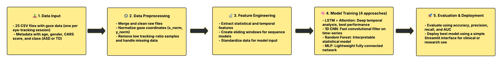

# Eye gaze detection
In this project, gaze-based signals were used to distinguish between typically developing (TD) children and those with ASD. The goal was to build robust classification models capable of supporting early diagnosis.

---

# 📊 Dataset
We used the [Eye Tracking Autism dataset](https://www.kaggle.com/datasets/imtkaggleteam/eye-tracking-autism) from Kaggle, consisting of:

- 🗂️ **25 CSV files** containing eye-tracking time-series data from 59 participants  
- 📄 **Metadata file** with participant age, gender, group label (TD or ASD), and CARS scores  
- 🎯 **Features** include:
  - Pupil diameter (left/right)
  - Gaze coordinates (x, y)
  - Tracking ratio
  - Areas of Interest (AOIs), fixation points, timestamps
- Balanced: ~50% ASD / 50% TD  
- Age range: 2.7 – 12.9 years  
- Data preprocessed: cleaned, normalized, aggregated, standardized

---

### 📈 Methodology Flowchart

---
## 🧠 Model Architectures

| Model | Description |
|-------|-------------|
| **LSTM + Attention** | Sequence model with Bidirectional LSTM layers followed by an Attention mechanism. Trained on time-series windows to capture temporal dynamics in gaze behavior. Achieved the highest AUC. |
| **1D CNN** | Convolutional model using 1D kernels to scan over time steps. Designed to detect local temporal patterns in gaze movements. Lighter than LSTM and faster to train. |
| **Random Forest (Simple)** | Classic ensemble of decision trees trained on statistical (aggregated) features. Quick to train and interpretable, but showed signs of underfitting. |
| **Random Forest (Tuned)** | GridSearchCV-optimized version of Random Forest with max depth and number of estimators tuned. Slight improvement over basic RF, but still inferior to neural models. |
| **Multilayer Perceptron (MLP)** | Fully connected neural network with two hidden layers, trained on statistical features. Lightweight and easy to implement, but lacks sequential modeling capabilities. |

---
## 🔧 Model Configuration Details

| Model | Architecture | Activation Functions | Batch Size | Epochs | Notes |
|-------|--------------|----------------------|------------|--------|-------|
| **LSTM + Attention** | 2× Bidirectional LSTM → Attention → Dense(1) | `tanh`, `sigmoid` | 16 | 100 | Attention highlights important time steps; high AUC |
| **1D CNN** | Conv1D → MaxPooling1D → Flatten → Dense(1) | `relu`, `sigmoid` | 32 | 100 | Fast training; good for short-term sequence patterns |
| **Random Forest (Simple)** | 100 trees (default params) | — | — | — | Basic version, lower performance |
| **Random Forest (Tuned)** | `n_estimators=200`, `max_depth=8` | — | — | — | Tuned via GridSearchCV; slight improvement |
| **MLP** | Dense(100) → Dropout(0.3) → Dense(50) → Dense(1) | `relu`, `sigmoid` | 32 | 100 | Lightweight; trained on aggregated gaze features |

---

## ✅ Evaluation Summary

| Model | Accuracy | Precision (ASD) | Recall (ASD) | F1-score (ASD) | AUC |
|-------|----------|-----------------|--------------|----------------|-----|
| **LSTM + Attention** | 81.3% | 73% | 77% | 75% | **0.894** |
| **1D CNN** | **82.6%** | 73.9% | 74.8% | 74.3% | — |
| **Random Forest (Simple)** | 66.0% | 71% | 50% | 58.3% | — |
| **Random Forest (Tuned)** | 70.0% | 72% | 55% | 62.4% | — |
| **Multilayer Perceptron (MLP)** | 71.6% | 74% | 57% | 64.4% | — |

---

## 🧰 Technologies Used

- `Python` (Pandas, NumPy, Scikit-learn)
- `TensorFlow/Keras` for LSTM and CNN
- `Streamlit` for web deployment
- `Matplotlib` / `Seaborn` for visualization

---

## ✔️ Strengths and Limitations

**Strengths:**
- Sequence models that capture eye movement dynamics
- Balanced dataset with metadata
- Models tested and compared across different paradigms

**Limitations:**
- Small sample size
- Some missing gaze data and tracking noise
- Dataset only covers children in a narrow age range

---

## 🚀 Future Work

- Expand dataset (more participants, diverse age/gender groups)
- Incorporate multimodal features (audio, facial expressions)
- Combine CNN and LSTM in hybrid models
- Improve interpretability with SHAP or LIME
- Real-time optimized deployment for clinical screening

---

This project was developed as part of the Artificial Intelligence course at the Faculty of Electrical Engineering, University of Sarajevo, by [Lamija Gutić](https://github.com/lamijagutic), [Dženeta Milić](https://github.com/dmilic1), and [Fatima Kaljanac](https://github.com/amit24af).

